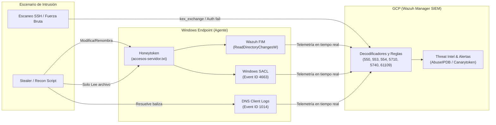

```mermaid
flowchart LR
    subgraph Endpoint ["Windows Endpoint (Agente)"]
        HT["Honeytoken\n(accesos-servidor.txt)"]
        FIM["Wazuh FIM\n(ReadDirectoryChangesW)"]
        SACL["Windows SACL\n(Event ID 4663)"]
        DNS["DNS Client Logs\n(Event ID 1014)"]
    end

    subgraph Attacker ["Escenario de Intrusión"]
        BOT["Stealer / Recon Script"]
        SCAN["Escaneo SSH / Fuerza Bruta"]
    end

    subgraph Cloud ["GCP (Wazuh Manager SIEM)"]
        DEC["Decodificadores y Reglas\n(550, 553, 554, 5710, 5740, 61109)"]
        TI["Threat Intel & Alertas\n(AbuseIPDB / Canarytoken)"]
    end

    BOT -->|Modifica/Renombra| HT --> FIM
    BOT -->|Solo Lee archivo| HT --> SACL
    BOT -->|Resuelve baliza| DNS
    SCAN -->|kex_exchange / Auth fail| DEC
    FIM & SACL & DNS -->|Telemetría en tiempo real| DEC --> TI
```
